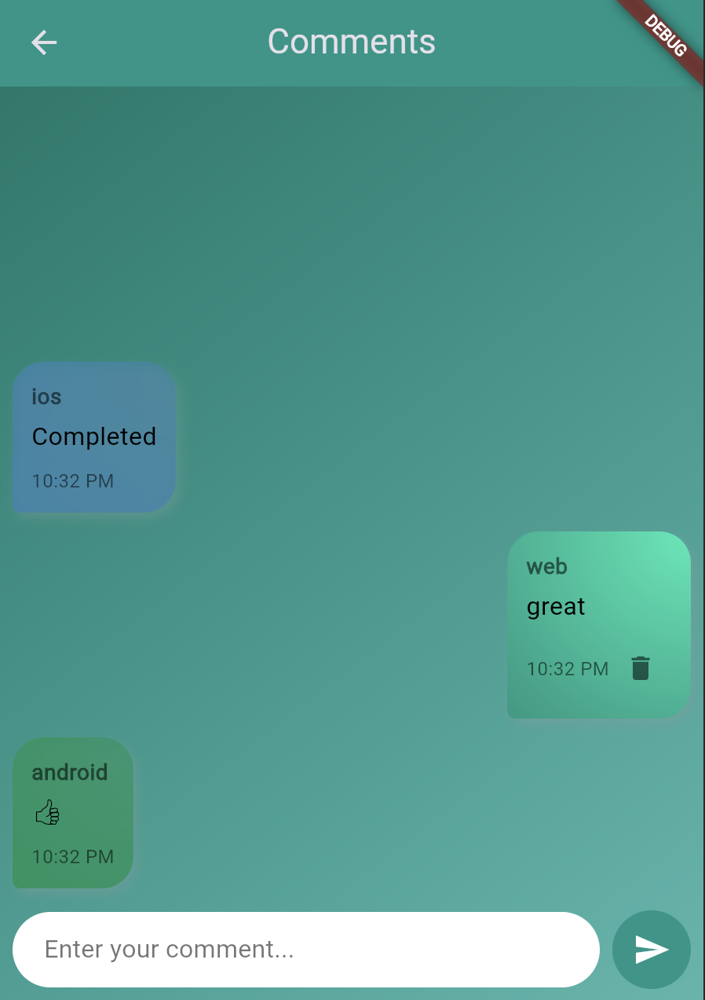
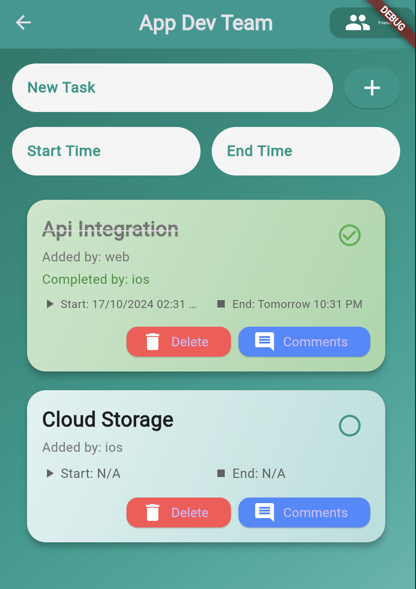
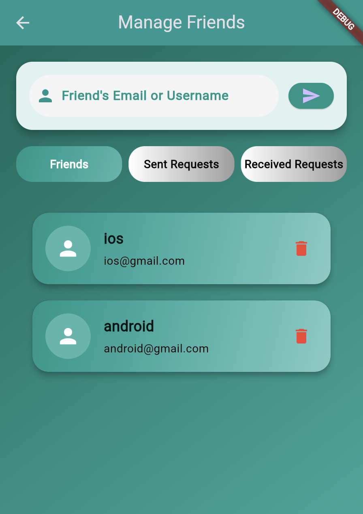
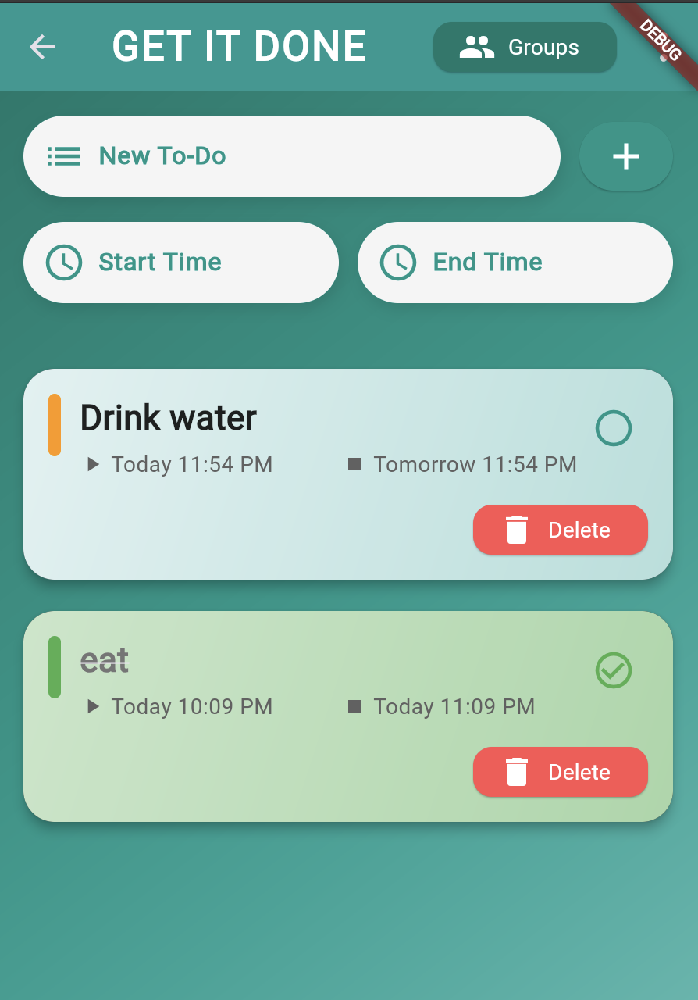

## GetItDone - Collaborative Task Management App

GetItDone is a Flutter-based application designed for seamless collaboration on group to-do lists. With Firebase as the backend, the app provides real-time data sync, secure authentication, push notifications, and a friend system. It is designed to make task management, group collaborations, and communication more efficient.

Features

	•	Shared Group To-Dos: Create and manage shared tasks in groups. Assign tasks to group members and track progress in real-time.
	•	Group Management: Easily manage groups with features to create, edit, and delete groups.
	•	Friend System: Add friends, form groups, and collaborate on tasks together.
	•	Comments on Tasks: Add comments to tasks for better collaboration and feedback.
	•	Push Notifications: Stay updated with real-time notifications for tasks, friend requests, and updates.
	•	Authentication: Secure login and registration through Firebase.
	•	Profile Management: Manage your profile with customizable features.

## Screenshots

<table>
  <tr>
    <td>
      
    </td>
    <td>
      
    </td>
  </tr>
  <tr>
    <td>
      
    </td>
    <td>
      
    </td>
  </tr>
</table>

## Folder Structure

Here’s an overview of the folder structure of the app:
'''
lib/
│
├── sharedTodo/                             # Core app functionality
│   ├── comments.dart                       # Comment system for tasks
│   ├── create_group_page.dart              # Page to create new task groups
│   ├── friends_page.dart                   # Friend management page
│   ├── group_management_page.dart          # Page for managing group settings
│   ├── group_task_card.dart                # Widget for displaying task cards in group
│   ├── group_todos_page.dart               # Main page for group tasks
│   ├── group.dart                          # Group model and logic
│   ├── groups_page.dart                    # Display list of groups
│   ├── home_page.dart                      # Home screen with task summary
│   ├── login_page.dart                     # Login screen for authentication
│   ├── profile_page.dart                   # Profile management page
│   └── register_page.dart                  # User registration page
│
├── push_notifications/                     # Notification services
│   ├── push_notification_service.dart      # Handles push notifications
│   ├── save_device_token.dart              # Save device token for notifications
│
├── service/                                # Backend services and logic
│   ├── auth_service.dart                   # Handles authentication
│   ├── friend_service.dart                 # Manages friend-related services
│   ├── messages_service.dart               # Message and chat service
│   └── todo_service.dart                   # To-do task-related services
│
├── widgets/                                # Reusable widgets
│   ├── BubbleWidget.dart                   # Custom widget for displaying bubbles in chat
│   ├── todo_card.dart                      # Custom widget for displaying to-do items
│   └── about_page.dart                     # About page widget
│
├── firebase_options.dart                   # Firebase configuration
├── main.dart                               # Main entry point for the app
'''
